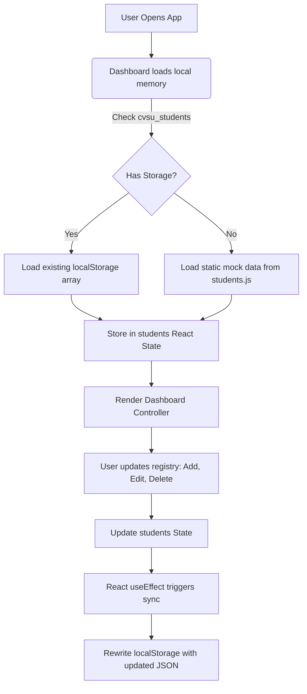

# 🏫 Cavite State University (CvSU) Tanza Campus
## Student Management System UI — Technical & Feature Documentation

This document provides a highly structured and comprehensive explanation of the **Student Management System UI**, designed and built as a group laboratory project for **DCIT 26 - Application Development** (Second Semester, SY 2025-2026).

---

## 🏛️ Project Identity & Aesthetics

The application represents a modular, professional, and responsive web portal themed explicitly around the institutional branding of **Cavite State University (CvSU)**.

*   **Color System:** A curated, harmonious, and highly premium HSL palette emphasizing institutional colors:
    *   **Emerald Green** (`bg-emerald-800`, `text-emerald-800`) representing academic excellence and growth.
    *   **Gold/Yellow accents** (`border-yellow-400`, `text-yellow-600`) representing historical prestige.
    *   **Sleek Base tones** (`bg-base-100`, `bg-base-200/40`) providing high readability and a clean look.
*   **Typography:** Enhanced with the premium Google Font **Outfit** (`sans-serif`), providing a clean, contemporary aesthetic.
*   **Micro-Animations:** Fluid CSS transitions on buttons, cards, inputs, and badges using standard cubic-bezier curves for a responsive, interactive feel.
*   **Device Adaptability:** Double-responsive viewport planning:
    *   *Desktops:* Uses a traditional layout with a top navigation bar, a persistent left-side navigation panel, and side-by-side grids.
    *   *Mobile Viewports:* Transforms to a bottom app-bar styled dock layout, with dense tables converting automatically into touch-friendly cards, and scrolls to forms when edit modes trigger.

---

## 🛠️ Technology Stack

1.  **Frontend Framework:** React 19 (leveraging modern lifecycle elements and state patterns).
2.  **Build Toolchain:** Vite (ensuring sub-millisecond hot module replacement and optimized production builds).
3.  **Styling & UI Kit:** Tailwind CSS v4 & DaisyUI v5 (providing powerful layout tools, utility classes, and flexible semantic component patterns).
4.  **Local Persistence:** Web Storage API (`localStorage`) to guarantee data continuity across browser refreshes.

---

## 📁 Architectural & File Directory Mapping

The codebase has been refactored into a highly maintainable, component-driven directory tree to achieve strict separation of concerns:

```
Student Management System UI/
├── index.html                   # Document entry point & Google Font injection
├── package.json                 # Dependency configuration (React 19, Tailwind v4, DaisyUI v5)
├── vite.config.js               # Development and bundling config
└── src/
    ├── main.jsx                 # Bootstrap loader
    ├── App.jsx                  # Main wrapper rendering the dashboard core
    ├── App.css                  # Custom global application styles
    ├── index.css                # Tailwind and DaisyUI integration, Outfit font rules
    ├── data/
    │   └── students.js          # Preloaded mock list of initial student enrollees
    ├── components/
    │   ├── Navbar.jsx           # Top sticky header with branding, real-time date, and profiles
    │   ├── Sidebar.jsx          # Left navigation sidebar for tab state control
    │   ├── DashboardCards.jsx   # Top metrics dashboard widget for enrolled, catalog, and faculty
    │   ├── SearchBar.jsx        # Real-time search query and course/year directory filter
    │   ├── StudentTable.jsx     # Responsive visual directory representation (adapts to screen size)
    │   ├── StudentForm.jsx      # Multi-mode creation/editing form with GPA & email validation
    │   └── StudentDetailModal.jsx # Full profiles drawer displaying dense information cards
    └── pages/
        ├── Dashboard.jsx        # Core application orchestrator, states container, and layout manager
        ├── StudentDirectory.jsx # Wrapper binding searching, listing tables, forms, and guides
        ├── CourseCatalog.jsx    # Card overview of offered institutional programs (CEIT)
        └── CvsuInfo.jsx         # Cavite State University academic philosophy display page
```

---

## 🧩 Comprehensive Feature Breakdown

### 1. 📊 Portal Dashboard Overview
The command center of the system, offering a broad snapshot of the campus registry:
*   **Dynamic Metrics Widget (`DashboardCards.jsx`):** Renders beautiful gradient cards representing total student headcount, undergraduate programs, and total faculty list. The counts react dynamically as students are added or deleted.
*   **Admissions Activity Feed:** Lists the last 4 registered students in the system inside a compact, responsive sub-table.
*   **Academic Philosophy Cards:** Highlights the official **CvSU Vision & Mission** inside an elegant forest-green glassmorphic container.
*   **System Utility Panel:** Contains functional interactive drafts for administrative actions:
    *   `Backup DB`: Emits a success confirmation toast.
    *   `Export CSV`: Compiles the active local students list, generates a secure download link, and exports real-time data into a `.csv` file.
    *   `Print Page`: Integrates standard browser print handlers.
    *   `Reset Data`: Wipes custom entries and reverts storage to the original database defaults.

### 2. 👨‍🎓 Student Directory Registry (Dynamic CRUD Operations)
A complete management subsystem utilizing robust state bindings in `Dashboard.jsx`:
*   **Real-time Filters (`SearchBar.jsx`):** Employs full multi-criteria filtering. Administrators can type in name keywords, search student IDs, isolate courses (BSCS, BSIT, BSSE, BSCE), and filter by year levels.
*   **Smart Tables (`StudentTable.jsx`):** Renders clean data sets. Renders custom badges (`Active` in green, `On Leave` in amber, `Inactive` in red) and generates visual letters for avatars. On smaller displays, complex multi-column grids fold seamlessly into readable individual cards.
*   **Multi-mode Form Processor (`StudentForm.jsx`):**
    *   *Create Mode:* Automatically generates a unique, format-compliant Student ID (e.g., `2026-XXXXX`). As the user types their name, it dynamically suggests an institutional email format (e.g., `firstname.lastname@cvsu.edu.ph`).
    *   *Edit Mode:* Clones the selected student's deep profile state directly into inputs. Highlights options for full edits and transforms action buttons to warn of editing states.
    *   *Form Validation:* Runs active integrity checks. Asserts mandatory fields and validates academic GPAs specifically between the institutional standards of `1.0` (highest mark) and `5.0` (lowest/failing mark).
*   **Profile Drawer (`StudentDetailModal.jsx`):** Triggers a beautiful modal backdrop displaying contact details, gender, home address, and academic scores of a student.

### 3. 📚 College Course Catalog (`CourseCatalog.jsx`)
Details the program offerings of the **College of Engineering and Information Technology (CEIT)**:
*   Includes detailed descriptions for:
    *   *BS Computer Science (BSCS)*
    *   *BS Information Technology (BSIT)*
    *   *BS Software Engineering (BSSE)*
    *   *BS Computer Engineering (BSCE)*
*   Features a dynamic counter badge (`👥 X Enrolled`) on each course card, illustrating current program enrollment figures calculated straight from the main registry array.

### 4. 🏫 CvSU Philosophy Portal (`CvsuInfo.jsx`)
An educational page presenting the core academic philosophy of Cavite State University:
*   Includes the full details of the **Vision**, **Mission**, **Quality Policy**, and the institutional **Core Values** (**T-R-U-T-H**):
    *   **T**enacity
    *   **R**espect
    *   **U**prightness
    *   **T**ransparency
    *   **H**ard Work
*   Styled with gorgeous gold borders, soft shadow layers, and custom typography to read like an official university brochure.

---

## 🔄 Stateful Navigation & Local Storage Synchronization

The application relies on clean reactive bindings to execute logic without a backend:



### Toast Feedback Engine
Whenever a student is registered, updated, or removed, a centralized feedback callback generates a visual notification (`Toast`) with corresponding iconography and border styles. It handles auto-dismiss timeouts to maintain clean UX layouts.

---

## 💎 Design and UX Highlights
1.  **Premium Glassmorphic Gradients:** Using modern CSS gradient declarations to build high-end institutional visual containers.
2.  **Active Mobile Support:** Floating touch bottom menu with quick-trigger view-tab switching, optimized tap targets, and smart auto-scrolling to help students and administrators navigate fields easily on small mobile layouts.
3.  **Tailwind 4 + DaisyUI 5:** Embraces modern utility pipelines, minimizing inline overrides and maximizing visual component consistency across all sections of Cavite State University Tanza Campus.
